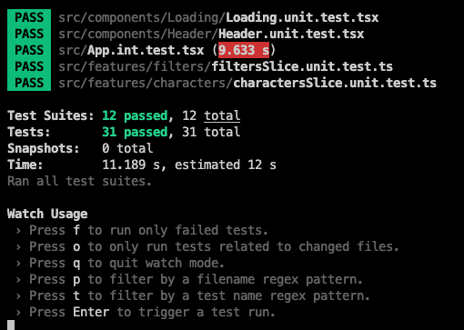
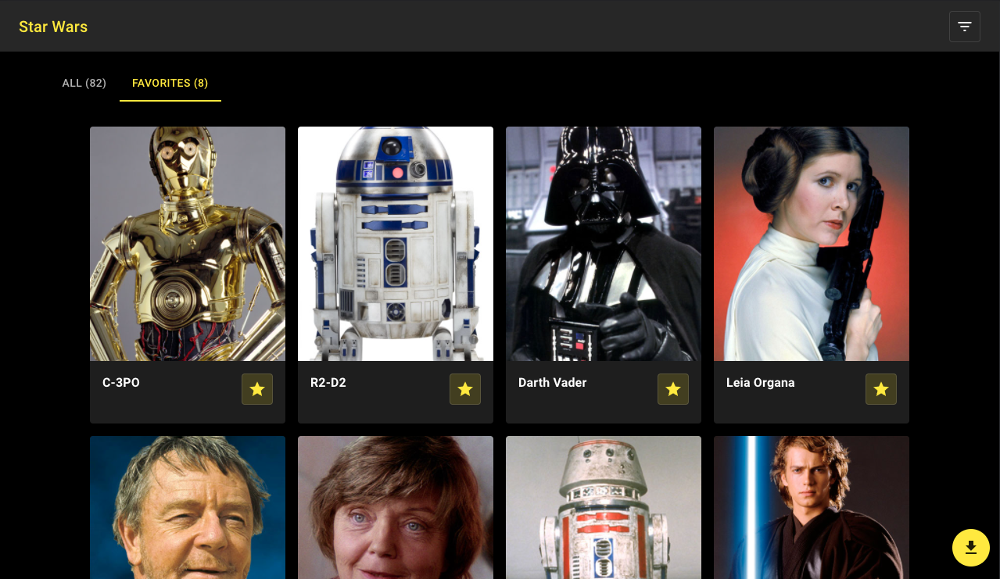

# Star Wars Demo - TypeScript, React, GraphQL, MSW, Redux, RTK, Jest, Testing Library

### Hi!

This is a demo application that shows Star Wars characters which includes functionality such as saving, download csv and filtering records.

### Technology stack used

- TypeScript
- @redux/toolkit for opinionated redux setup
- RTK Query
- Jest and React Testing Library for Unit and Integration Test
- MSW & Faker for integration testing data needs

## Test



## Screenshot



### Instructions on how to run

- yarn install
- yarn start
- yarn test

### Folder structure

- src/components - generic components
- src/features - components connected with redux and reducer
- src/app/api - backend api
- src/mocks - mock data for testing

# Note

I am using redux toolkit it uses [immerjs](https://immerjs.github.io/immer/docs/introduction) behind the scene that enables developer to write mutation operations that are translated to immutable operation

```ts
// This is immutable operation behind the scene courtesy of immerjs
toggleIsLoading: (state) => {
      state.isLoading = !state.isLoading;
    },
```

I would love to have your feedback regarding the application. If you have question or would want me to explain parts of it please let me know. If for some reason the app doesn't run please let me know. (sbalbalosa@gmail.com)

Thanks,
Sharlon Balbalosa
